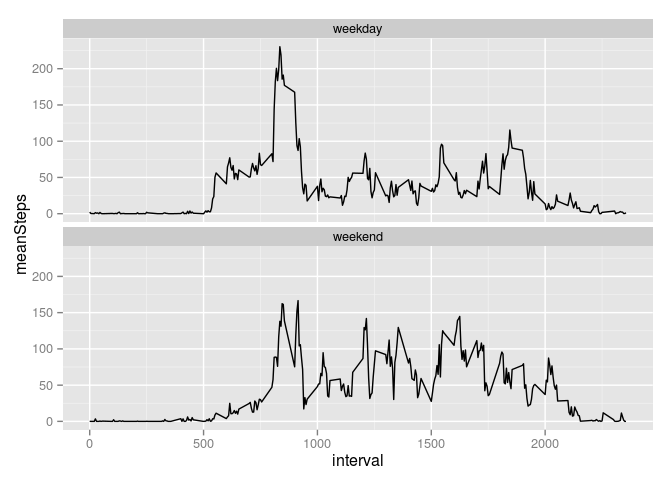

# Reproducible Research: Peer Assessment 1


### Loading and preprocessing the data


```r
raw <- read.csv('activity.csv')
```

### What is mean total number of steps taken per day?
1. Make a histogram of the total number of steps taken each day


```r
totalStepsPerDay <- tapply(raw$steps,raw$date,sum)
hist(totalStepsPerDay)
```

 

2. Calculate and report the mean and median total number of steps taken per day

```r
mean(totalStepsPerDay,na.rm=T)
```

```
## [1] 10766.19
```

```r
median(totalStepsPerDay,na.rm=T)
```

```
## [1] 10765
```


### What is the average daily activity pattern?
1. Make a time series plot (i.e. type = "l") of the 5-minute interval (x-axis) and the average number of steps taken, averaged across all days (y-axis)

```r
meanStepsPerInterval <- tapply(raw$steps,raw$interval,mean,na.rm=T)
plot(names(meanStepsPerInterval),meanStepsPerInterval,type='l',xlab='interval(min)',ylab='average steps',main='average steps across all days')
```

 


2. Which 5-minute interval, on average across all the days in the dataset, contains the maximum number of steps?

```r
meanStepsPerInterval[which.max(meanStepsPerInterval)]
```

```
##      835 
## 206.1698
```

### Imputing missing values
1. Calculate and report the total number of missing values in the dataset (i.e. the total number of rows with NAs)

```r
nas <- raw[is.na(raw$steps),]
nrow(nas)
```

```
## [1] 2304
```
2. Create a new dataset that is equal to the original dataset but with the missing data filled in.

```r
imputed <- raw
#inpute NAs with average step of that interval
imputed[is.na(imputed$steps),]$steps <- meanStepsPerInterval[as.character(imputed[is.na(imputed$steps),]$interval)]
```
3. Make a histogram of the total number of steps taken each day and Calculate and report the mean and median total number of steps taken per day


```r
totalStepsPerDay <- tapply(imputed$steps,imputed$date,sum)
hist(totalStepsPerDay)
```

 

```r
mean(totalStepsPerDay,na.rm=T)
```

```
## [1] 10766.19
```

```r
median(totalStepsPerDay,na.rm=T)
```

```
## [1] 10766.19
```
*the median is different from the original dataset*


### Are there differences in activity patterns between weekdays and weekends?
1. Create a new factor variable in the dataset with two levels -- "weekday" and "weekend" indicating whether a given date is a weekday or weekend day.

```r
date = weekdays(strptime(imputed$date,"%Y-%m-%d"))
week <- ifelse(date %in% c("Sunday","Saturday"),'weekend','weekday')
imputed$week <- week
```

2. Make a panel plot containing a time series plot (i.e. type = "l") of the 5-minute interval (x-axis) and the average number of steps taken, averaged across all weekday days or weekend days (y-axis).

```r
library(plyr)
library(ggplot2)
weekdayOrweekends <- ddply(imputed,.(interval,week),summarise,meanSteps=mean(steps))
g <- ggplot(weekdayOrweekends)
g+geom_line(aes(x=interval,y=meanSteps))+facet_wrap(~week,nrow=2)
```

 
